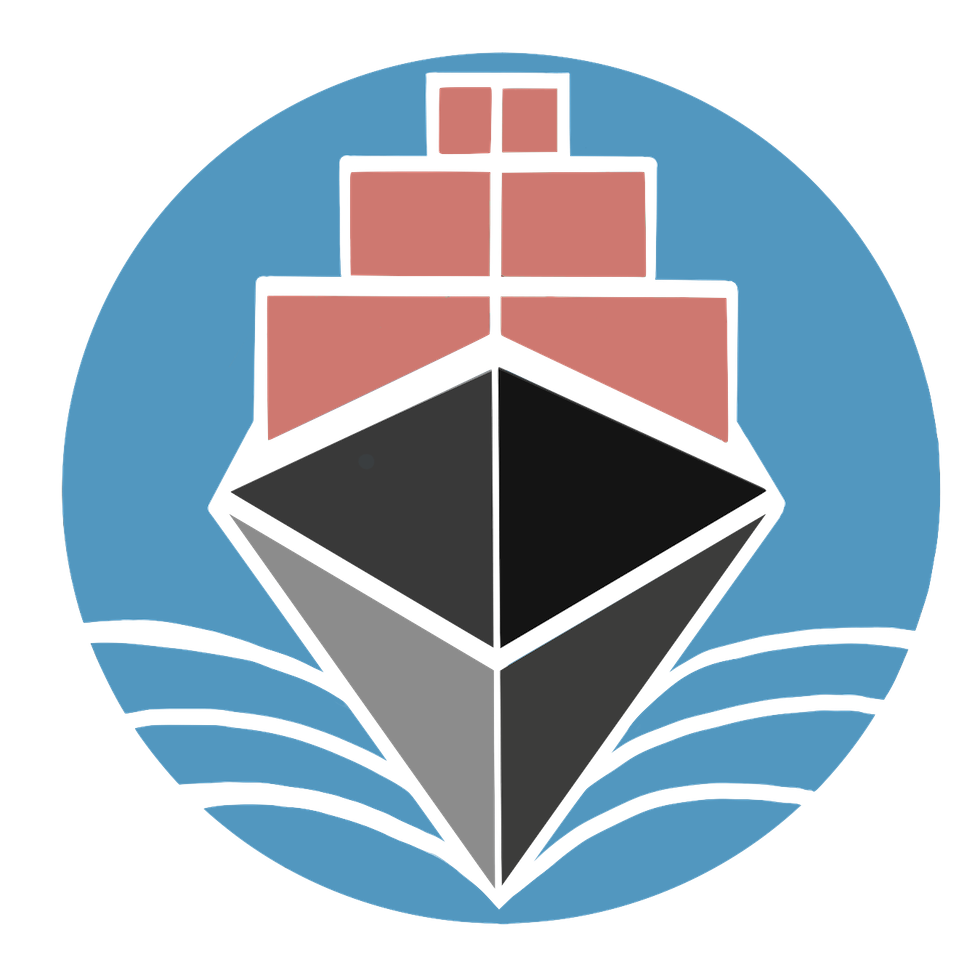

<div style="text-align:center">

<h1> Crowdtainer Web App </h1> </div>
<br/>


Web-based application to interact with the [Crowdtainer solidity contracts](https://github.com/crowdtainer/dapp-contracts).

## Development

### To start a development server:

```bash
npm run dev

# or

npm run dev -- --open #open in browser
```

### Building for production:

```bash
npm run build #(generated in ./build)
```

To preview: 

```bash
npm run preview
```

### Remarks

To keep the application as *simple* and *readable* as possible, [SvelteKit](https://kit.svelte.dev) was chosen as a framework, configured with TailWindCSS / PostCSS, as a static page (@sveltejs/adapter-static).

We strive to keep it in `static` mode (without backends) to allow for hosting the app in a variety of emerging trustless CDN's such as IPFS and SWARM.
