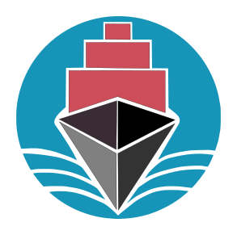

<div style="text-align:center">

<h1> Crowdtainer Web App </h1> </div>
<br/>

Web-based (Svelte) application to interact with the [Crowdtainer solidity contracts](https://github.com/crowdtainer/dapp-contracts).

## Development

To run everything locally, follow the instructions in [Crowdtainer solidity contracts](https://github.com/crowdtainer/dapp-contracts) to run and deploy the contracts (`npx hardhat node`).
Once a blockchain or RPC can be connected to, proceed setting up this frontend per instructions below.

### Environment variables
```bash
# Copy and make sure to set appropriate values.
cp .env.example .env
```

### Install dependencies:

```bash
# node dependencies:
npm install

# install local redis instance:
brew install redis # MacOS

# For other OS's see: https://redis.io/docs/getting-started/installation/
```

> Note: Redis and E-mail service are only required for service providers using CCIP-Read for off-chain verification rules (i.e., signer != address(0) in the deployed project). If the project doesn't require CCIP-Read, Redis is not required. Allowing projects without CCIP-Read is still work to be done in this frontend, but should be trivial as we just need to remove all steps when "joining" a project, and instead call join() in the smart-contract directly.


---
### To start a development server:

 Run redis server:
 ```bash
redis-server

# Alternatively, to run as a MacOS service:
brew services start redis
 ```

 Run frontend:

```bash
npm run dev

# or

npm run dev -- --open #open in browser
```

---

### Building for production:

```bash
npm run build #(generated in ./build)
```

To preview: 

```bash
npm run preview
```

### Frameworks

- [SvelteKit](https://kit.svelte.dev) 
- TailWindCSS

---

## User Stories

- ✅ for completed items, ◻️ otherwise.

### As an observer (anyone, including page loaded without any wallet connected):

- I'd like to be able to get basic information of a crowdtainer project deployed, such as:
    - ✅ See a list of active crowdtainer projects
        - Can be a static list/item for MVP.
    - ✅ All information used during deployment (opening and closing time, etc).
        - Use `ICrowdtainer.CampaignData`.
    - ✅ Check the project status (Funding, Expired, Delivery, Finalized).
        - Use `Crowdtainer.crowdtainerState()`.
    - ✅ If active, percentage of goal so far (progress bar).
        - Use `Crowdtainer.totalValueRaised()` and `CampaignData.targetMinimum().` to calculate percentage.
    - ◻️ IPFS/Swarm hash which points to the legal sale contract agreement documents.

### As a participant

- ✅ Once I open one of the listed projects (from screen of observer user stories above), I'd like to see the product list and prices, so that I can specify my order and sign a transaction to participate in the group buying.
    - The product name can be read from `Vouchers721.productDescription[crowdtainerId]()`.
    - Prices can be read from `Crowdtainer.unitPricePerType()`.

- ✅ I'd like to view if the project's goal was reached, so that I can decide to either withdrawl my funds or wait for product delivery.
    - Use `Crowdtainer.crowdtainerState()`.

- ✅ Allow connection/disconnection to WalletConnect and properly manage its state (localStore to remember connection).


- ✅ - Button to effectively 'join' the project.
    - To join the project call `ICrowdtainer.join()`.

- ✅ Button to 'leave' the project.
    - This would call `ICrowdtainer.leave()` smart contract method.

- ◻️ CCIP-Read support to allow arbitrary off-chain verifications before joining a project (meet law requirements).
    - ✅ Add requirement of participant signing Terms and Conditions with their wallet.
    - ✅ E-mail / code verification.
    - ✅ Server checks if code + Terms & Conditions signature are valid.
    - ◻️ Button to effectively 'join' the project via CCIP-Read method.
        - To join the project call `ICrowdtainer.joinWithSignature()`.

- ◻️ I'd like an interface/button to claim refunds if the sale was not successful.
    - Only possible if the project is in `Failed` state.
    - Use `Crowdtainer.claimFunds()` method.

- ◻️ After joining, I'd like to see my own purchase/voucher details, as a SVG image.
    - Use `Vouchers721.tokenUri()` to get the generated image.

- ◻️ I'd like an interface to see how much I bought for each type of product, to get an overview of my own order.

- ◻️ Possibility of transfering NFT/participation proof ownership to another wallet.

- ◻️ "Checkout" button (available once funded/suceeded) to conclude the order with service provider.

- ◻️ "Download Invoice" button (available once "Checkout" succeeded).

##### Out of scope for MVP:
- ◻️ When joining, I'd like to additionally specify:
    - ◻️ whether I'd like to be eligible to share referral code so that I can get rewards for my friend's purchases (check-box).
    - ◻️ a friend's referral code, so that I can get a discount on my own purchase (address/ENS text input field).

- ◻️ I'd like an interface to view how much rewards I acquired due sharing of personal referral code, if the project succeeds.
    - Use `Crowdtainer.accumulatedRewardsOf()` method.

- ◻️ I'd like an interface/button to claim rewards due sharing of referral code.
    - Only possible if the project is in `Delivery` state.
    - Use `Crowdtainer.claimRewards()` method.